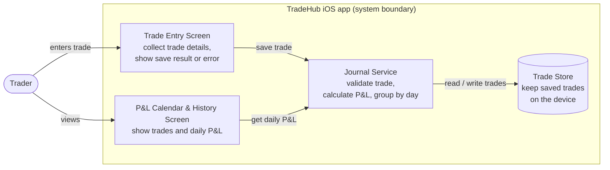

# Architecture v1 — TradeHub

ISE4133 Software Engineering · Week 5 · Draft for M3 (Architecture & Prototype)

---

## Worksheet 1 — Structure

**Team / product / members**
AF Team / TradeHub / Adilbekov Adilbek, Madrakhimov Feruzbek

**Input source**
Week 4 file `M2_story_slice.md` (story S1 and its criteria, IDs kept) and M1 Product Vision.

**One user task**
Log a closed demo trade so it appears in trade history and on the P&L calendar.
(This is the second half of the M1 main task: *open a chart → review → log the trade*.)

**Scope boundary (excluded)**
Real broker connection and live order execution. Market prices and account data are mock/demo only. Charting and the social feed are outside this view.

### Requirement and acceptance criteria

| ID | Required behavior / observable expected result |
|---|---|
| **S1** | As a retail trader, I want to log a demo trade so that I can see its profit/loss in my history and P&L calendar. |
| **S1-AC1** | Given a closed **long** demo trade — AAPL, qty 10, entry 100.00, exit 105.00, closed 2026-10-05 — when the trader saves it, the trade appears in history and the calendar cell for **5 Oct** shows **+50.00**. |
| **S1-AC2** | Given a trade with **quantity 0 or a missing exit price**, when the trader saves it, the app shows an error message, nothing is saved, and the calendar is unchanged. |

### Structure diagram (logical view)



Plain-text version (for paper):

```
            +--------------------- TradeHub iOS app --------------------+
Trader ---> | Trade Entry Screen --save trade--> Journal Service         |
   |        |                                     |   ^                 |
   |        |                          read/write |   | get daily P&L   |
   |        |                                     v   |                 |
   +------> | P&L Calendar & History    Trade Store     Calendar Screen |
            +-----------------------------------------------------------+
```

**Arrow legend:** `A --> B` means **A uses/calls B**; results return to A. A return value has no separate arrow. Boxes are logical responsibilities, not separate servers — everything runs inside one iOS app.

**Criterion 1 path (S1-AC1)**
Trader fills in the Trade Entry Screen → Entry calls Journal Service *save trade* → Journal validates the trade, calculates P&L = (105.00 − 100.00) × 10 = **+50.00**, and writes it to Trade Store → Entry shows "Saved". When the trader opens the Calendar Screen, it calls Journal *get daily P&L* → Journal reads Trade Store and groups trades by closing date → Calendar shows **+50.00 on 5 Oct**, and the trade is listed in history.

**Criterion 2 path (S1-AC2)**
Same start, but Journal Service validation fails (qty 0 / no exit price) → Journal returns a validation error and **does not call Trade Store** → Entry Screen shows the error. The calendar path is unchanged because nothing new was stored.

**Known constraints, assumptions, one unresolved rule**
- Constraint: mock/demo data only; no backend or accounts in v1 (from M1).
- Assumption: trades are entered manually (the journal is not auto-filled from the chart).
- Assumption: P&L excludes fees and uses one currency.
- **Unresolved rule:** which day a trade belongs to on the calendar — the **closing date** (used above) or the opening date — and in which time zone. Also undecided: whether **open trades** (no exit yet) appear on the calendar at all.

*These are planned paths, not evidence that code has run.*

---

## Worksheet 2 — One decision

**Decision D1**
Put P&L calculation and validation in one **Journal Service**, separate from the screens.

**Related IDs and the need they create**
S1-AC1 needs a correct P&L number that is the **same** in history and on the calendar. S1-AC2 needs invalid trades stopped **before** they are saved.

**Option A vs. Option B**
- **A — Separate Journal Service:** the screens only collect and display data; one service validates, calculates, and saves.
- **B — Logic inside each screen:** the Entry Screen validates and saves directly to storage; the Calendar Screen calculates P&L itself.

**Chosen option and reason**
**Option A.** Quality attributes: **maintainability** and **consistency/correctness**. The P&L rule lives in one place, so history and the calendar cannot show different numbers, and the rule can be tested without the UI.

**Trade-off**
- *Benefit:* one place to change the P&L rule (e.g., adding fees or short trades later); easy to unit-test the AC1 numbers.
- *Cost:* an extra layer to build, and we must define and maintain the trade data format passed between the screens and the service.
- *Reconsider when:* a real backend or broker connection is added — calculation may then move to the server.

**Assumption behind the choice; next check**
Assumption: P&L will be shown in more than one place (history, calendar, and later maybe the social feed). Next check: write one test for the S1-AC1 numbers (+50.00) and one for S1-AC2 (no save), and walk through both paths with the SwiftUI prototype. Evidence: both tests pass and both screens show the same value.

---

## Five-minute peer review and save

- [ ] Both criteria can be traced through named responsibilities to visible results.
- [ ] Arrows are labeled; their direction and the system boundary are clear.
- [ ] D1 compares alternatives and explains a quality benefit and a real cost.
- [ ] Assumptions and planned checks are distinct from actual evidence.

**Ambiguity found; change made:** It was unclear whether the calendar shows a trade on its opening or closing date. Change made: the criterion paths use the **closing date**, and the question is recorded as the unresolved rule.

**Saved file/location:** `docs/Architecture_v1.md` in the team repository.

**AI use:** Draft structure prepared with Claude (Anthropic) from the team's M1 and M2 documents — see `AI_USAGE.md`.

**Week 6 handoff — one interaction for interface/API work:**
Trade Entry Screen → Journal Service `saveTrade(trade)` → returns *saved* or a *validation error*.
